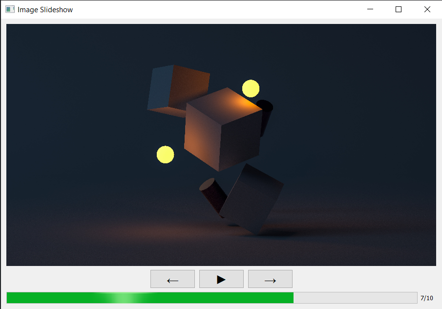
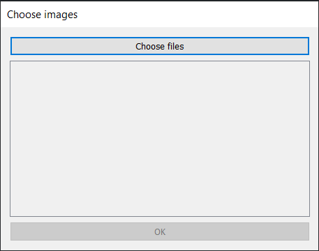

# Slideshow d'immagini

> Elaborato del corso "Laboratorio di programmazione" (B024260)

Visualizzatore di immagini che data "playlist" crea uno slideshow temporizzato. Usare Observer per mostrare avanzamento in playlist e immagine relativa in finestra display.

> Toolkit utilizzato per la creazione della GUI: [Qt Widgets](https://www.qt.io/)

---

### Slideshow

### Schermata per la scelta delle immagini

